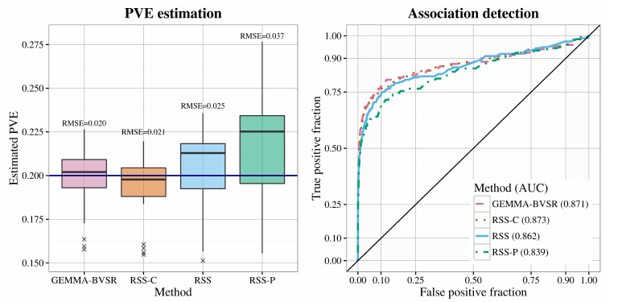
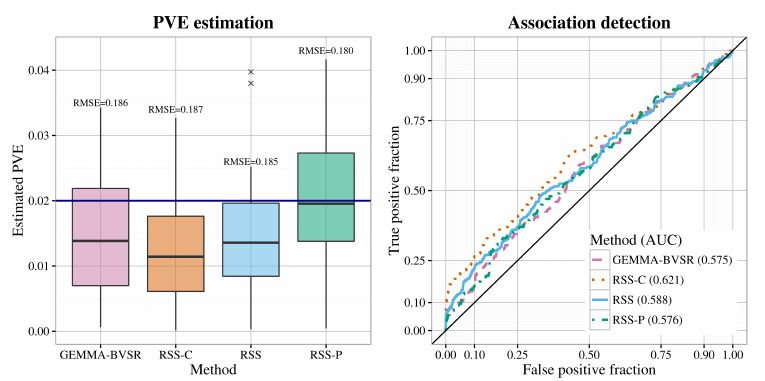
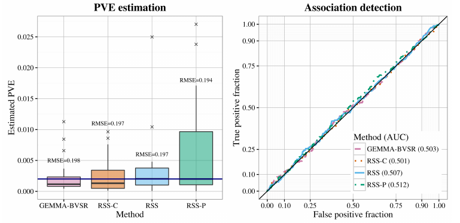

[Zhu and Stephens (*Ann. Appl. Stat.*, 2017)]: https://projecteuclid.org/euclid.aoas/1507168840
[`example2.m`]: https://github.com/stephenslab/rss/blob/master/examples/example2.m

# Example 2: Fit RSS-BVSR via MCMC with three types of LD matrices.

## Overview

This example illustrates the impact of different LD estimates on the
RSS results. Three types of estimated LD matrices are considered:
cohort sample LD, panel sample LD and
shrinkage panel sample LD in [Wen and Stephens, (*Ann. Appl. Stat.*, 2010)](https://www.ncbi.nlm.nih.gov/pubmed/21479081)
This example is closely related to Section 4.1 of [Zhu and Stephens (*Ann. Appl. Stat.*, 2017)][]. 

## Details

The single-SNP summary-level data are computed from a simulated GWAS dataset.
The simulation scheme is described in Section 4.1 [Zhu and Stephens (*Ann. Appl. Stat.*, 2017)][].
Specifically, 10 "causal" SNPs are randomly drawn from 982 SNPs on chromosome 16,
with effect sizes coming from standard normal N(0,1).
Effect sizes of remaining SNPs are zero. The true PVE (SNP heritability) is 0.2.

Three types of LD estimates are considered:

- cohort sample LD:<br>the sample correlation matrix using genotypes in the cohort (WTCCC UK Blood Service Control Group)
- shrinkage panel sample LD:<br>the shrinkage correlation matrix
([Wen and Stephens, *Ann. Appl. Stat.*, 2010](https://www.ncbi.nlm.nih.gov/pubmed/21479081))
using genotypes in the panel (WTCCC 1958 British Birth Cohort) 
- panel sample LD:<br>the sample correlation matrix using genotypes in the panel (WTCCC 1958 British Birth Cohort) 

To reproduce results of Example 2, please read the step-by-step guide below and run [`example2.m`][].
Before running [`example2.m`][], please make sure the
[MCMC subroutines](https://github.com/stephenslab/rss/tree/master/src) are installed.
Please find installation instructions [here](RSS-via-MCMC).

## Step-by-step illustration

**Step 1**.
Download the simulated single-SNP summary-level data and LD estimates
[`example2.mat`](https://projects.rcc.uchicago.edu/mstephens/rss_wiki/example2/).
Please contact me if you have trouble accessing these files.

The data file `example2.mat` contains the following elements.

- `betahat`: 982 by 1 vector, single-SNP effect size estimate for each SNP
- `se`: 982 by 1 vector, standard errors of the single-SNP effect size estimates
- `Nsnp`: 982 by 1 vector, sample size of each SNP
- `cohort_R`: cohort sample LD
- `shrink_R`: shrinkage panel sample LD
- `panel_R`: panel sample LD
- `snp_info`: 3 by 1 cell, ID and allele of each SNP

**Step 2**. Fit three RSS-BVSR models with different LD matrices.

```matlab
# cohort sample LD
[betasam, gammasam, hsam, logpisam, Naccept] = rss_bvsr(betahat, se, cohort_R, Nsnp, Ndraw, Nburn, Nthin);

# shrinkage panel sample LD
[betasam, gammasam, hsam, logpisam, Naccept] = rss_bvsr(betahat, se, shrink_R, Nsnp, Ndraw, Nburn, Nthin);

# panel sample LD
[betasam, gammasam, hsam, logpisam, Naccept] = rss_bvsr(betahat, se, panel_R, Nsnp, Ndraw, Nburn, Nthin);
```

## More simulations

The simulations in Section 4.1 of [Zhu and Stephens (*Ann. Appl. Stat.*, 2017)][]
are essentially "replications" of the example above. To facilitate reproducible research,
we make the simulated datasets in Section 4.1 available
([`rss_example2_data_*.tar.gz`](https://projects.rcc.uchicago.edu/mstephens/rss_wiki/example2/readme))<sup>1</sup>.

Each simulated dataset contains three files:
`genotype.txt`, `phenotype.txt` and `simulated_data.mat`.
The files `genotype.txt` and `phenotype.txt` are the genotype and phenotype files for
[`GEMMA`](https://github.com/xiangzhou/GEMMA).
The file `simulated_data.mat` contains three cells.

```matlab
true_para = {pve, beta, gamma, sigma};
individual_data = {y, X};
summary_data = {betahat, se, Nsnp};
```

Only the `summary_data` cell above is used as the input for RSS methods.

RSS methods also require an estimated LD matrix.
The three types of LD matrices are provided in the file `genotype2.mat`<sup>1</sup>.

After applying RSS methods to these simulated data,
we obtain the following results.

### True PVE = 0.2



### True PVE = 0.02



### True PVE = 0.002



--------

**Footnotes:**

1. Currently these files are locked, since they contain individual-level genotypes
from Wellcome Trust Case Control Consortium (WTCCC, https://www.wtccc.org.uk/).
You need to get permission from WTCCC before we can share these files with you.
