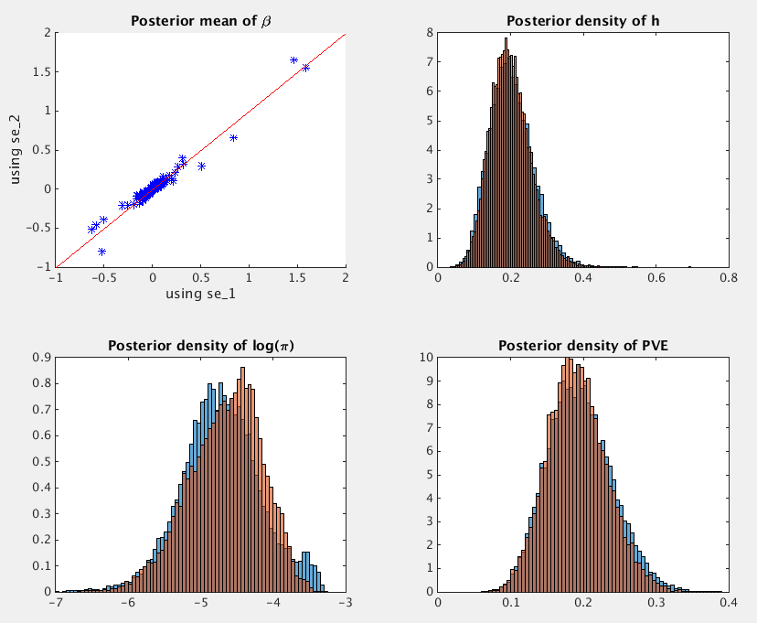
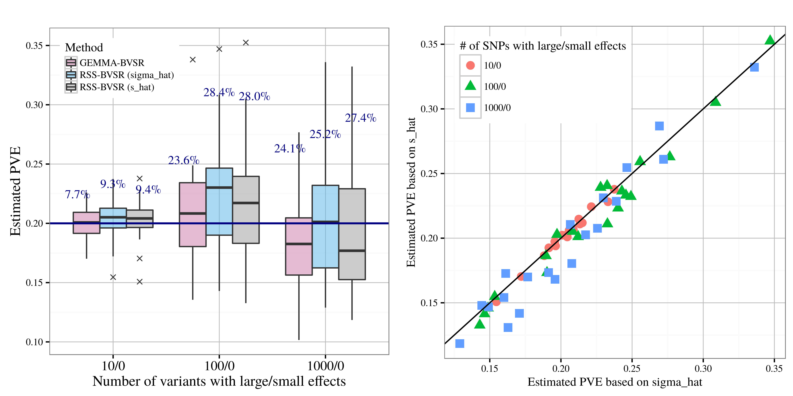
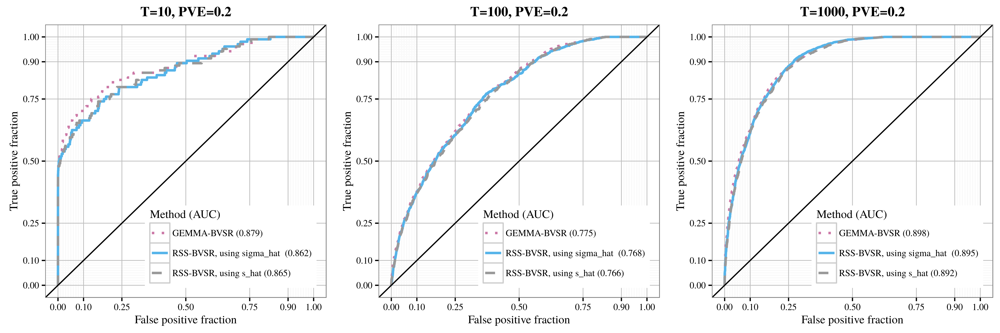

[Zhu and Stephens (*Ann. Appl. Stat.*, 2017)]: https://projecteuclid.org/euclid.aoas/1507168840
[`example3.m`]: https://github.com/stephenslab/rss/blob/master/examples/example3.m

# Example 3: Fit RSS-BVSR via MCMC with two types of standard error (SE) vectors.

## Overview

This example illustrates the impact of two definitions of `se` on RSS.
This example is closely related to Section 2.1 of
[Zhu and Stephens (*Ann. Appl. Stat.*, 2017)][].

The "simple" version of `se` is the standard error of single-SNP effect estimate,
which is often directly provided in GWAS summary statistics database.
The "rigorous" version of `se` is used in theoretical derivations of RSS
(see Section 2.4 of [Zhu and Stephens (*Ann. Appl. Stat.*, 2017)][]),
and it requires some basic calculations based on the commonly available summary statistics.


In practice, we find these two definitions differ negligibly, mainly because

1. recent GWAS have large sample size (`Nsnp`) and small effect sizes (`betahat`);
see Table 1 of [Zhu and Stephens (*Ann. Appl. Stat.*, 2017)][];
2. published summary data are often rounded to two digits to
further limit the possibility of identifiability (e.g. [GIANT](http://portals.broadinstitute.org/collaboration/giant/index.php/GIANT_consortium_data_files#GIANT_consortium_2012-2015_GWAS_Metadata_is_Available_Here_for_Download)). 

Hence, we speculate that using these two definitions of `se` exchangeably
would not produce severely different results in practice.
Below we verify this speculation by simulations. 

## Details

Here we use the same dataset in [Example 1](Example-1).
Please contact me if you have trouble downloading the dataset
[`example1.mat`](https://projects.rcc.uchicago.edu/mstephens/rss_wiki/example1/).

To reproduce results of Example 3, please read the step-by-step guide below and run [`example3.m`][].
Before running [`example3.m`][], please make sure the
[MCMC subroutines of RSS](https://github.com/stephenslab/rss/tree/master/src) are installed.
Please find installation instructions [here](RSS-via-MCMC).

## Step-by-step illustration

**Step 1**. Define two types of `se`.

We let `se_1` and `se_2` denote the "simple" and "rigorous" version respectively.

```matlab
se_1 = se;                                      % the simple version
se_2 = sqrt((betahat.^2) ./ Nsnp + se.^2);      % the rigorous version 
```

Before running MCMC, we first look at the difference between these two versions of `se`.
Below is the five-number summary<sup>1</sup> of the absolute difference between `se_1` and `se_2`.

```matlab
>> abs_diff = abs(se_1 - se_2);  
>> disp(prctile(log10(abs_diff), 0:25:100)); % require stat toolbox
  -12.0442   -4.6448   -3.9987   -3.4803   -1.3246
```

To make this example as "hard" as possible for RSS,
we do not round `se_1` and `se_2` to 2 significant digits.

**Step 2**. Fit RSS-BVSR using two versions of `se`.

```matlab
[betasam_1, gammasam_1, hsam_1, logpisam_1, Naccept_1] = rss_bvsr(betahat, se_1, R, Nsnp, Ndraw, Nburn, Nthin);
[betasam_2, gammasam_2, hsam_2, logpisam_2, Naccept_2] = rss_bvsr(betahat, se_2, R, Nsnp, Ndraw, Nburn, Nthin);
```

**Step 3**. Compare the posterior output.

We can look at the posterior means of `beta`,
and posterior distributions of `h`, `log(pi)` and PVE
based on `se_1` (blue) and `se_2` (orange).



The PVE estimate (with 95% credible interval) is 0.1932, [0.1166, 0.2869] when using `se_1`,
and it is 0.1896, [0.1162, 0.2765] when using `se_2`.

## More simulations

The simulations in Section 2.3 of [Zhu and Stephens (*Ann. Appl. Stat.*, 2017)][]
are essentially "replications" of the example above. To facilitate reproducible research,
we make the simulated datasets available
([`rss_example1_simulations.tar.gz`](https://projects.rcc.uchicago.edu/mstephens/rss_wiki/example1/readme))<sup>2</sup>.

After applying RSS methods to these simulated data,
we obtain the following results, where
`sigma_hat` corresponds to `se_1`, and `s_hat` corresponds to `se_2`.

### PVE estimation



### Association detection



--------

**Footnotes:**

1. The function [`prctile`](http://www.mathworks.com/help/stats/prctile.html) used here
requires the [Statistics and Machine Learning Toolbox](http://www.mathworks.com/help/stats/index.html).
Please see this [commit](https://github.com/stephenslab/rss/pull/3/commits/566e149ed840a913bfef9c0d7bf82feb41d6735d)
(courtesy of Dr. [Dr. Peter Carbonetto](https://pcarbo.github.io/))
if this required toolbox is not available in your environment.

2. Currently these files are locked, since they contain individual-level genotypes
from Wellcome Trust Case Control Consortium (WTCCC, https://www.wtccc.org.uk/).
You need to get permission from WTCCC before we can share these files with you.
